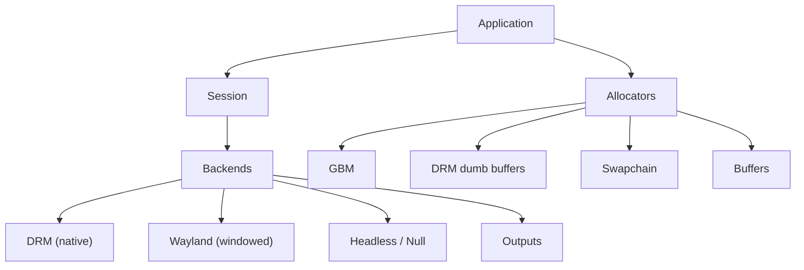

# Aquamarine

[](https://github.com/toxicwind/aquamarine)
[](https://en.cppreference.com)
[](https://cmake.org)
[](LICENSE)

> **A very light Linux rendering backend library** — basic abstractions for an application to render on a Wayland session (in a window) or a native DRM session. Agnostic of the rendering API (Vulkan/OpenGL), designed to be lightweight, performant, and minimal. C++-only; no bindings for other languages.

This is a fork of [hyprwm/aquamarine](https://github.com/hyprwm/aquamarine) (v0.12.1). Upstream description above is preserved verbatim.

## 🏗️ Architecture



| Module | Path | Purpose |
|---|---|---|
| Backends | `src/backend/` | DRM, Wayland, Headless, Null session backends + frame scheduler |
| Allocators | `src/allocator/` | GBM, DRM dumb, Swapchain buffer allocation |
| Buffers | `src/buffer/` | buffer abstractions |
| Outputs | `src/output/` | output / display handling |
| Input | `src/input/` | input device handling (libinput) |
| Public API | `include/aquamarine/` | public headers mirroring the modules |

## Stability

Aquamarine depends on the ABI stability of the stdlib implementation of your compiler. Sover bumps will be done only for aquamarine ABI breaks, not stdlib.

## Dependencies

From `CMakeLists.txt` (all required):

- `libseat >= 0.8.0`, `libinput >= 1.26.0`, `libdrm`, `gbm`, `libudev`
- `wayland-client`, `wayland-protocols`, `hyprwayland-scanner >= 0.4.0`
- `hyprutils >= 0.8.0`, `pixman-1`, `libdisplay-info`, `hwdata`
- OpenGL GLES3, C++23 compiler, CMake >= 3.19, pkg-config

## 🔨 Building

```sh
cmake --no-warn-unused-cli -DCMAKE_BUILD_TYPE:STRING=Release -DCMAKE_INSTALL_PREFIX:PATH=/usr -S . -B ./build
cmake --build ./build --config Release --target all -j`nproc 2>/dev/null || getconf _NPROCESSORS_CONF`
```

A Nix flake (`flake.nix`) and CMake presets (`CMakePresets.json`, with sccache/ccache launcher configured by default) are also provided. See `docs/env.md` for environment notes.

Tests live in `tests/` (`SimpleWindow.cpp` is the canonical minimal example).

## 📄 License

BSD 3-Clause — see [LICENSE](LICENSE). Copyright (c) 2024, Hypr Development.
